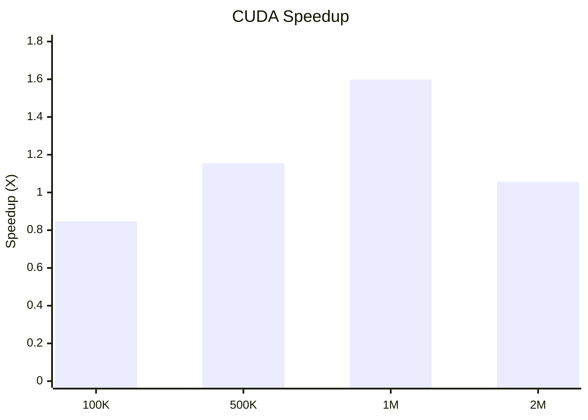
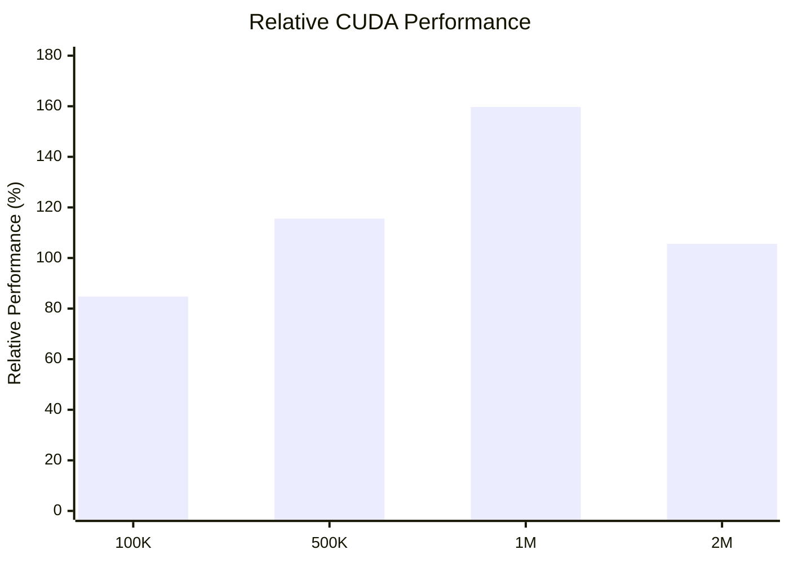

# Team 8 - GPU Dataset Processing

## Objective

Process a large numerical dataset using CUDA and analyze the execution time.

## Technology Used

- CUDA
- C++
- Google Colab
- NVIDIA Tesla T4 GPU

## Dataset Sizes

The experiment was performed using the following dataset sizes:

- 100,000 elements
- 500,000 elements
- 1,000,000 elements
- 2,000,000 elements

## Implementation

Two implementations were used:

1. Sequential CPU implementation
2. CUDA GPU implementation

The CUDA implementation was tested using:

- 128 threads per block
- 256 threads per block
- 512 threads per block

## Results

The execution time of the CPU and CUDA implementations was measured for different dataset sizes.

### 1. Execution Time

The following graph compares the sequential CPU execution time with the best CUDA execution time.

```mermaid
xychart-beta
    title "CPU vs CUDA Execution Time"
    x-axis ["100K", "500K", "1M", "2M"]
    y-axis "Execution Time (seconds)" 0 --> 0.008
    bar [0.00037482, 0.00210569, 0.00515975, 0.00750882]
    bar [0.00044192, 0.00182208, 0.00323046, 0.00711136]

```

### 2.  Speedup

Speedup is calculated using:

**Speedup = CPU Execution Time / CUDA Execution Time**

### 3.CUDA Efficiency 

## Key Findings

- CUDA performance was compared with sequential CPU execution for different dataset sizes.
- The highest speedup was **1.60× for the 1M dataset**.
- CUDA was slower than CPU for the 100K dataset due to GPU execution overhead.
- Different thread configurations (**128, 256, and 512 threads/block**) produced slightly different execution times.
- The optimal thread configuration varied with the dataset size.

## Conclusion

The experiment demonstrates how CUDA can be used for parallel processing of large numerical datasets. The results show that GPU acceleration can improve execution performance for suitable workloads, while the choice of thread configuration also affects execution time.
